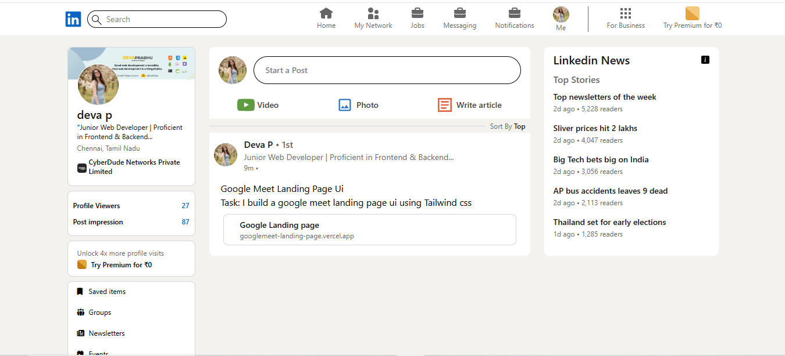

## Linkedin Clone Page
A frontend project built using Vanilla JavaScript and Tailwind CSS v4.

## Wireframes

---

## Technologies Used
- **HTML5:** Semantic markup
- **TailwindCSS:** flex box,grid

---
## Future Enhancements
- Add JavaScript for enhanced interactivity
- Implement dark mode toggle

---

### Live link:

[View Live Project](https://deva-p-stack.github.io/linkedin/)

---
## Getting Started
**Prerequisites**
- Node js 18+
- TailwindCSS

**Installation**
 - Clone the repository
 - Install dependencies
 - Run the development sever
 - Open teh broswer Navigate to http://localhost:5000

---

## Author
- **Devaprabhu p**
- Email:  [devap677@gmail.com](mailto:devap677@gmail.com)  
- GitHub: [github.com/deva-p-stack](https://github.com/deva-p-stack)  

---

## Acknowledgement:

Special thanks to [Anbuselvan Rocky](https://github.com/anburocky3) for his valuable mentorship.

---

## References
[W3Schools TailwindCSS Tutorials](https://www.w3schools.com)
